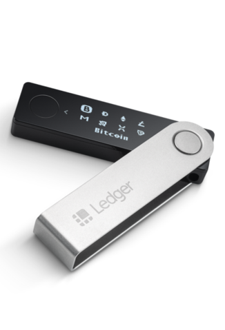

You are new to bitcoin and want to buy some crypto. You head over to an exchange like Coinbase or Binance and create an account. You create something called a wallet which generates a public and a private key and then purchase bitcoin from the exchange. Shortly after you have bitcoin in your wallet - but what does that actually mean? 

## Public Keys and Private Keys

Public and private keys are how users send and receive bitcoin on the network. A public key is a wallet address, or where you tell you friends to send the bitcoin. When you purchased bitcoin from the exchange, the exchange sent you bitcoin to your wallet address. A private key is what signs the transaction when you  send bitcoin, it's basically your password to send assets to another user or address. Think of it like a shared post office mailbox - everyone knows your address to send mail to, but only you have the private key to open the box. Therefore, if anyone has access to your private key, they have access everything in your bitcoin wallet. If you store your bitcoin on an exchange or wallet, you are storing your assets in whats known as a **hot wallet.**  A hot wallet is any wallet that is connected to the internet, so anytime you access a wallet through an app or the internet you are using a hot wallet.

## What happens if you are hacked?

Get hacked - Whaaat? If you store your digital assets on an exchange that gets hacked, you may lose all your funds. There is no middleman gatekeeper (think paypal - which stores your funds between your bank and another party) in the bitcoin network that controls funds and says where they go. In May of 2019 Binance, the largest crypto exchange in the world was hacked and [$40 million worth of Bitcoin was stolen](https://www.bloomberg.com/news/articles/2019-05-08/crypto-exchange-giant-binance-reports-a-hack-of-7-000-bitcoin). In this case, Binance covered the losses, however if it was a smaller exchange or a larger hack they may not have been able to afford the losses to pay back its users. Therefore you should always secure your crypto in **cold storage**.

## Securing Assets in Cold Storage

Cold storage is a physical hardware device with a wallet that store digital assets like bitcoin. This is where you should store the largest part of your crypto stash. It's a hardware wallet that plugs into your computer like a usb stick and can send and receive bitcoin(or other coins). It's best to store this in a safety deposit box in a bank or a safe where you will not lose it. If this device is lost or stolen, burned in a fire, or lost in your laundry basket - ciao your funds are gone. However, some hardware wallets such as a Ledger Nano allow you to recover your lost or destroyed device with a 24 word mnemonic phrase.

## Wrapup

As technology changes the way we trade and invest in a new emerging asset class, we must understand the risks and how to properly safe keep them. Always store your digital assets in a hardware wallet and keep it somewhere safe. The only time you should have assets on the exchange is when you want to trade.
