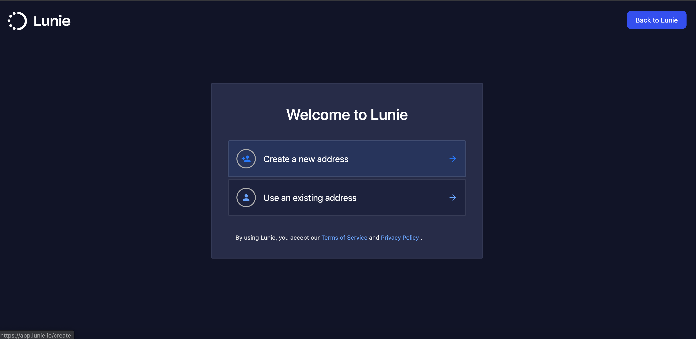
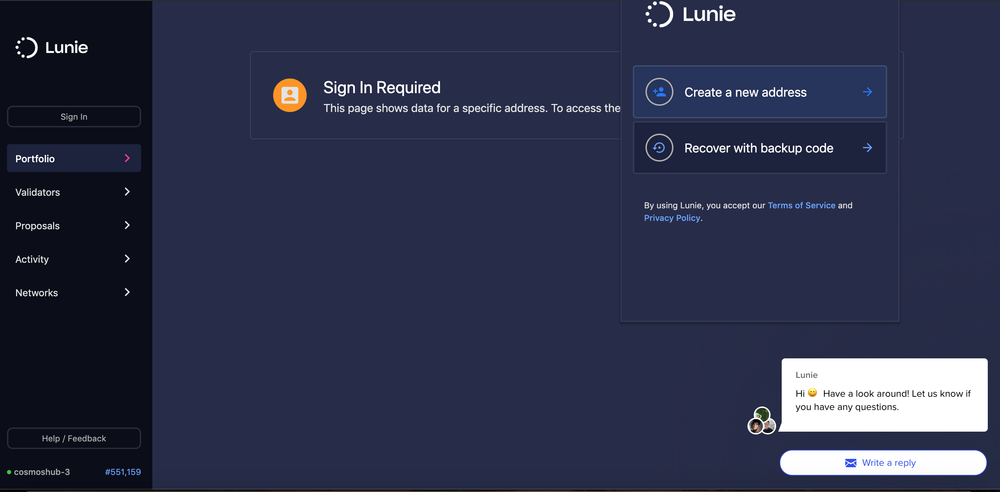
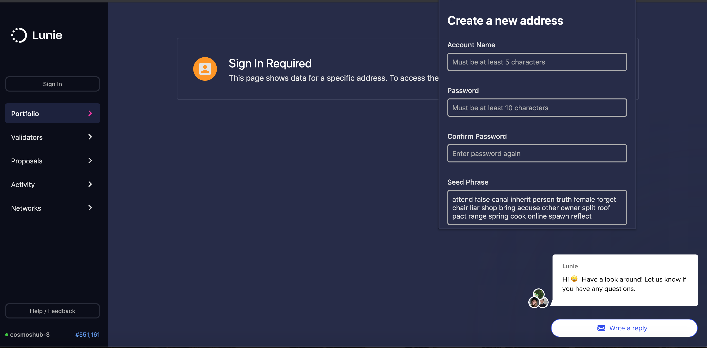
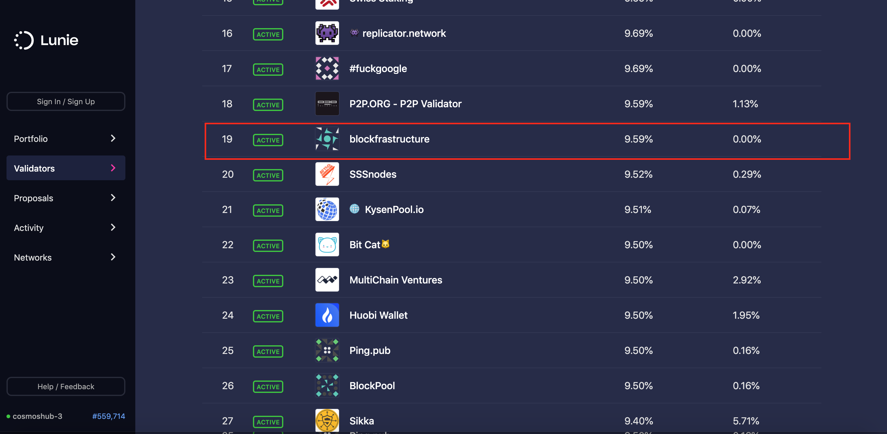
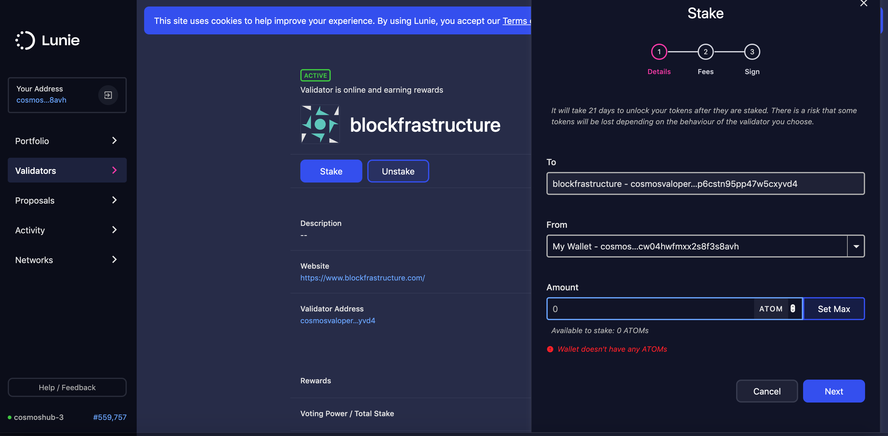

New to staking with Cosmos? Don't worry we created a simple guide to show how to stake ATOMS and start earning returns. 
[Lunie](https://lunie.io/) offers 2 methods to safely stake cosmos with validators. Lunie offers a [browser extension](https://chrome.google.com/webstore/detail/lunie-browser-extension/hbaijkfbhhdhhjdfbpdafkjimohblhgf) as well as nano ledger integration to stake your ATOMS. In this article we will use the browser extension.

 

 

First we will need to create a new cosmos address. In order to do that in a secure and safe manner download the browser extension on the [chrome store](https://chrome.google.com/webstore/detail/lunie-browser-extension/hbaijkfbhhdhhjdfbpdafkjimohblhgf). Once you have installed the browser extension click the lunie icon in the toolbar and select "Create a new address".

 

 

Now we can create a new address! Fill in the details and save your seedphrase somewhere. REMEMBER its crucial
to never lose the seedphrase. This is the only way you can recover your account if you forget your password so its important to store it somewhere safe.

 

 

After creating your account you are now ready to stake your ATOMS. Click on validators on the menu and scroll or search until you find us "Blockfrastructure"

 

 

Click on the button "Stake" and depending on if you are loggen in with the browser extension either sign in 
or follow the process. Here you select the number of ATOMs you wish to stake. After click sign and save and BOOM you are done!
Congratulations! Now you will start earning rewards.

 

